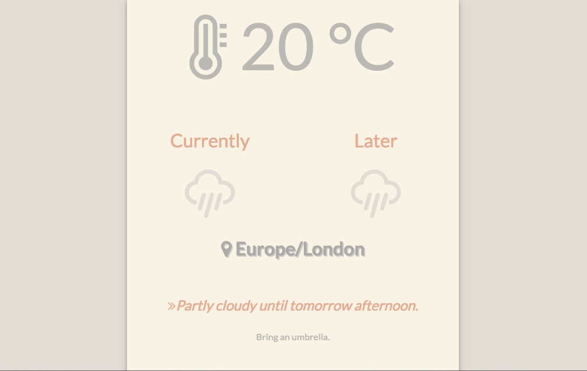

# Weather App

A weather app using the [Dark Sky API](https://darksky.net/dev/). The app shows current temperature and weather conditions at user's location as well as weather condition later in the day and offers a suggestion on what to wear/bring.

## App Preview

## Instructions

1. Clone this repository to your local machine using the command line: 
    `git clone https://github.com/pinglinh/weather_app_2.git`
2. From the command line, run: 
    `open index.html`
3. Browser will asks for permission to know your location - select `allow`.

